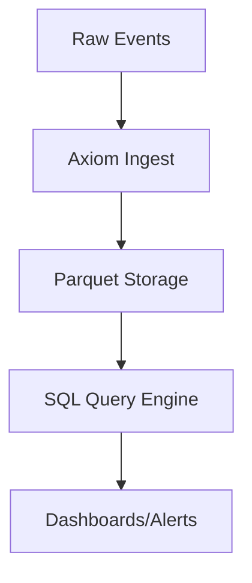

+++
title = "Axiom vs ELK Stack: Souboj observability gigantů"
authors = ["Dany Chaker"]
date = 2025-01-20
insert_anchor_links = "heading"
draft = true
+++

## Axiom vs Elasticsearch/Logstash/Kibana: Souboj 2025

ELK (Elasticsearch, Logstash, Kibana) byl de facto standard log managementu desetiletí. Ale s explodujícími objemy dat – čas na nového šampiona?

### Benchmarky výkonu

| Metrika | Axiom | ELK Stack |
|---------|-------|-----------|
| Ingest Rate | 10TB/day/node | 1TB/day/node |
| Query Latency (1TB) | <1s | 5-30s |
| Storage Cost | $2.5/TB/mo | $5-10/TB/mo |
| Komprese | 15:1 | 5:1 |

### Hluboký ponor do architektury

**ELK bolesti**:
- Index lifecycle management peklo
- Heap tlak na velkých clusterech
- Shard rebalancing downtime

**Axiom inovace**:
- **Write-Once Read-Many** storage
- Columnar formát (Arrow-based)
- Serverless scaling



## Migration Guide

1. **Export ELK data**:
```bash
# Use axiom CLI to replay logs
axiom ingest --pipeline-from-es http://es-cluster:9200/my-index
```

2. **Přepsat Kibana Dashboards**:
Axiom podporuje Kibana JSON export → SQL migration tool brzy.

## Real-World Case Study

Migrace 500GB/day pipeline:
- **Úspory**: 65% nižší náklady
- **MTTR**: Z 20min na 45s
- **Spolehlivost**: Zero shard failures v 6 měsících

## Vynesení

**ELK pro malé-střední týmy**, **Axiom pro scale**.

Budoucnost je raw storage + SQL.

[_Benchmarky z axiom.co/case-studies_]
