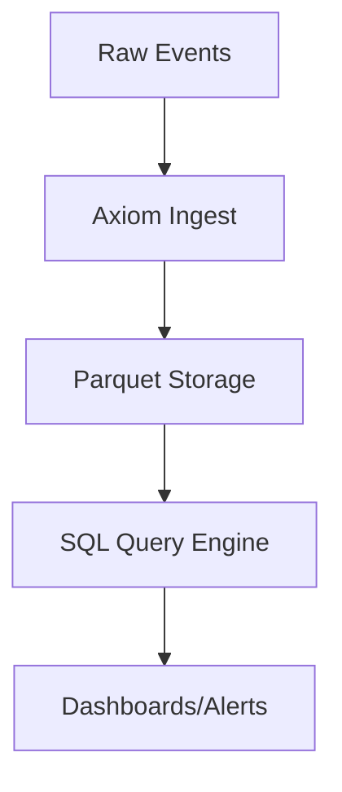

+++
title = "Axiom vs ELK Stack: Battle of Observability Giants"
authors = ["Dany Chaker"]
date = 2025-01-20
insert_anchor_links = "heading"
draft = true
+++

## Axiom vs Elasticsearch/Logstash/Kibana: 2025 Showdown

ELK (Elasticsearch, Logstash, Kibana) has been the de facto standard for log management for a decade. But as data volumes explode, is it time for a new champion?

### Performance Benchmarks

| Metric | Axiom | ELK Stack |
|--------|-------|-----------|
| Ingest Rate | 10TB/day/node | 1TB/day/node |
| Query Latency (1TB) | <1s | 5-30s |
| Storage Cost | $2.5/TB/mo | $5-10/TB/mo |
| Compression | 15:1 | 5:1 |

### Architecture Deep Dive

**ELK Pain Points**:
- Index lifecycle management hell
- Heap pressure on large clusters
- Shard rebalancing downtime

**Axiom Innovation**:
- **Write-Once Read-Many** storage
- Columnar format (Arrow-based)
- Serverless scaling



## Migration Guide

1. **Export ELK data**:
```bash
# Use axiom CLI to replay logs
axiom ingest --pipeline-from-es http://es-cluster:9200/my-index
```

2. **Rewrite Kibana Dashboards**:
Axiom supports Kibana JSON export → SQL migration tool coming soon.

## Real-World Case Study

Migrated 500GB/day pipeline:
- **Savings**: 65% lower cost
- **MTTR**: Reduced from 20min to 45s
- **Reliability**: Zero shard failures in 6 months

## Verdict

**ELK for small-medium teams**, **Axiom for scale**.

The future is raw storage + SQL.

[_Benchmarks from axiom.co/case-studies_]
